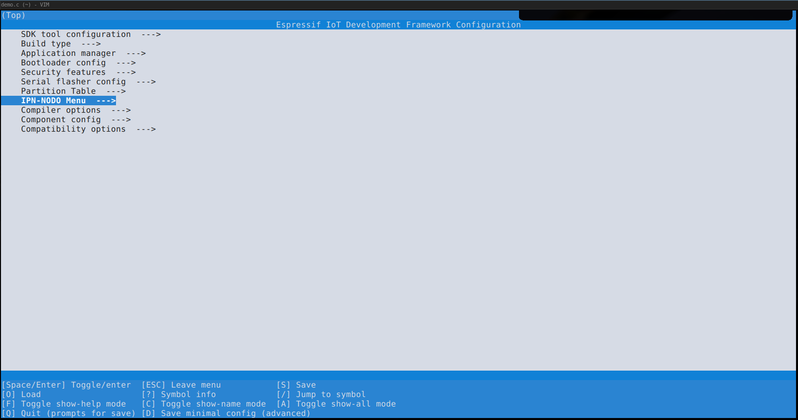
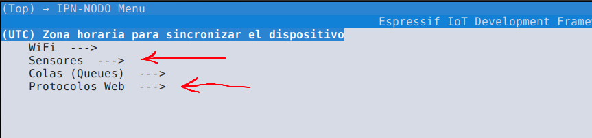
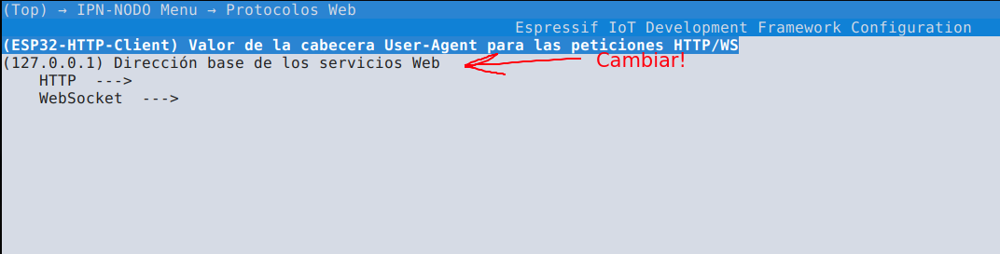
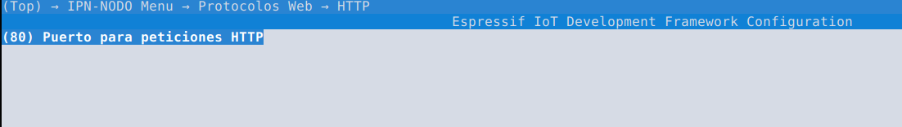
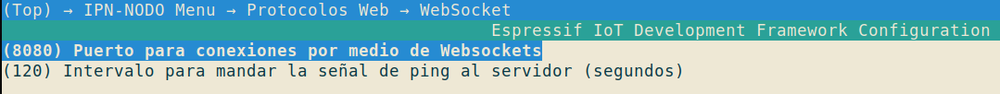
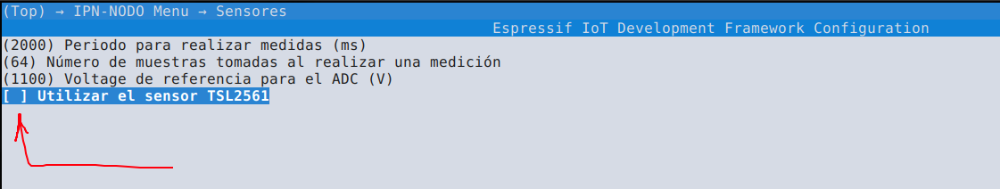

# ipn-nodo
Firmware del ESP32 para el proyecto TT2020-B031

## Instalación del kit de desarrollo
Instalar el kit de desarrollo ESP-IDF según [estas instrucciones](https://docs.espressif.com/projects/esp-idf/en/latest/esp32/get-started/index.html#installation-step-by-step). 
Dentro de la carpeta *examples/getting-started* del repositorio de *esp-idf* se pueden encontrar otros ejemplos para
probar la tarjeta.

## Instalación del firmware
Clonar el código de este repositorio y ejecutar el siguiente comando **dentro** de la carpeta del repositorio:
```bash
idf.py menuconfig
```
Aparecerá el siguiente menu:

Esta es la raíz del menú de configuración, aquí se pueden manipular diferentes parámetros de
configuración de la tarjeta, habilitar algunas funciones, etc. Dentro de este menú existen un submenu para 
ajustar parámetros operativos del nodo tales como la URL del servidor al que se conecta, la frecuencia de 
actualizaciones al servidor, habilitar o deshabilitar algunos sensores, etc. Se puede acceder a este menú mediante
la entrada *IPN-NODO Menu*

En la imagen se resaltan los **parámetros obligatorios** que hay que modificar antes de programar la tarjeta 
por primera vez.
## Establecer la dirección del servidor web
Se tiene que establecer una dirección IP o de dominio para acceder a los servicios web a los que
manda actualizaciones el dispositivo, esto se declara en el menú *Protocolos Web* en el campo
indicado en la siguiente imagen.

Además de establecer la dirección del servidor, se tiene que establecer el número de los puertos
para el servicio HTTP y WebSocket. Esto se hace entrando a los submenus de *HTTP* y *WebSocket*,
respectivamente, como se muestra en las imágenes. 


## Habilitar/deshabilitar el sensor TSL2561
En el menu de *Sensores* se puede activar el uso del sensor TSL2561, para medir la luminiscencia  Por default, esta
opción esta desactivada.


Nota: En caso de utilizar el TSL2561, se debe de haber clonado previamente el
repositorio de *esp-idf-lib* ([link](https://github.com/UncleRus/esp-idf-lib)), además de agregar la siguiente 
linea al archivo *CMakeLists.txt*
```
set(EXTRA_COMPONENT_DIRS <dirección del repositorio>)
```
